# Veternity — Schéma de la base de données

> **Ce document est la référence.** Le fichier `prisma/schema.prisma` de l'API, les services et les tests en découlent.
> Toute modification du modèle commence ici (diagramme + règles), dans la même pull request que la migration Prisma.
> Voir [`../STATUS.md`](../STATUS.md) pour l'état d'avancement général du projet.

Base : PostgreSQL 16 · ORM : Prisma · Extensions : `pg_trgm`, `btree_gist`.

> **Adresses e-mail :** pas d'extension `citext`. Prisma exclut un champ `Unsupported("citext")` des types de création/mise à jour du client généré, ce qui le rend impraticable pour une colonne que le service écrit couramment (adresse e-mail d'un utilisateur, d'un client, d'un fournisseur). Convention à la place : colonne `string`, normalisée en minuscule par le service avant toute écriture et toute lecture, avec un index **unique fonctionnel** `lower(colonne)` posé en SQL de migration (section 14) pour la garantie en base.

Les diagrammes sont en Mermaid : GitHub les affiche directement ; dans VS Code, installer l'extension *Markdown Preview Mermaid Support*.

---

## Sommaire

1. [Conventions](#1-conventions)
2. [Vue d'ensemble](#2-vue-densemble)
3. [Accès et sécurité](#3-accès-et-sécurité)
4. [Référentiels : clients, animaux, catalogue des actes](#4-référentiels--clients-animaux-catalogue-des-actes)
5. [Agenda](#5-agenda)
6. [Dossier médical : consultations et ordonnances](#6-dossier-médical--consultations-et-ordonnances)
7. [Facturation](#7-facturation)
8. [Stock et achats](#8-stock-et-achats)
9. [Documents et factures fournisseurs (OCR)](#9-documents-et-factures-fournisseurs-ocr)
10. [Alertes](#10-alertes)
11. [Énumérations](#11-énumérations)
12. [Cycles de vie (statuts)](#12-cycles-de-vie-statuts)
13. [Règles d'intégrité et leur application dans la logique](#13-règles-dintégrité-et-leur-application-dans-la-logique)
14. [Contraintes et index hors Prisma (SQL de migration)](#14-contraintes-et-index-hors-prisma-sql-de-migration)
15. [Correspondance avec les données de démo du frontend](#15-correspondance-avec-les-données-de-démo-du-frontend)

---

## 1. Conventions

| Sujet | Règle |
|---|---|
| Noms | Tables et colonnes en `snake_case`, tables au pluriel. Côté Prisma : modèle en `PascalCase` singulier + `@@map("table")`, champs en `camelCase` + `@map("colonne")` |
| Clé primaire | `id uuid` générée par la base (`gen_random_uuid()`), sauf journaux à fort volume (`audit_logs`, `stock_movements`) en `bigint identity` |
| Multi-clinique | **Toutes les tables métier ont `clinic_id uuid NOT NULL → clinics.id`**. Pour alléger les diagrammes, ce lien n'est dessiné qu'en section 3 |
| Isolation | Les relations entre tables métier utilisent des **clés étrangères composites** `(clinic_id, x_id) → parent(clinic_id, id)`, ce qui rend impossible en base de lier un animal d'une clinique au client d'une autre |
| Horodatage | `created_at timestamptz NOT NULL DEFAULT now()` et `updated_at timestamptz` sur toutes les tables (omis des diagrammes) |
| Montants | `numeric(12,2)` (type `decimal` dans les diagrammes). Jamais de `float` |
| Quantités | `numeric(12,3)` : les injectables se dosent en fractions de ml |
| Taux | `numeric(5,2)` en pourcentage (ex : remise 5,00) |
| Dates | Instants en `timestamptz` (UTC) ; dates calendaires (péremption, naissance) en `date` |
| Suppression | Pas de suppression physique des données métier : `archived_at` (clients, animaux, produits, fournisseurs) ou statut `CANCELLED`. Utilisateurs : `status = DISABLED`. Journaux : ajout seul |
| Clés étrangères | `ON DELETE RESTRICT` par défaut. `CASCADE` uniquement pour les enfants sans existence propre (lignes d'un brouillon, sessions d'un utilisateur) |
| Valeurs figées | Un document émis (acte, facture, ordonnance) **copie** les libellés et les prix au moment de l'émission ; il ne dépend plus du catalogue ensuite |
| E-mails | Toujours stockés en minuscule ; unicité insensible à la casse via un index `lower(email)`, jamais via `citext` (voir la note en tête de document) |

Notation des diagrammes : `PK` clé primaire, `FK` clé étrangère, `UK` unique. Les commentaires entre guillemets précisent le type SQL ou la règle.

---

## 2. Vue d'ensemble

Tables principales et relations entre domaines (colonnes détaillées dans les sections suivantes).

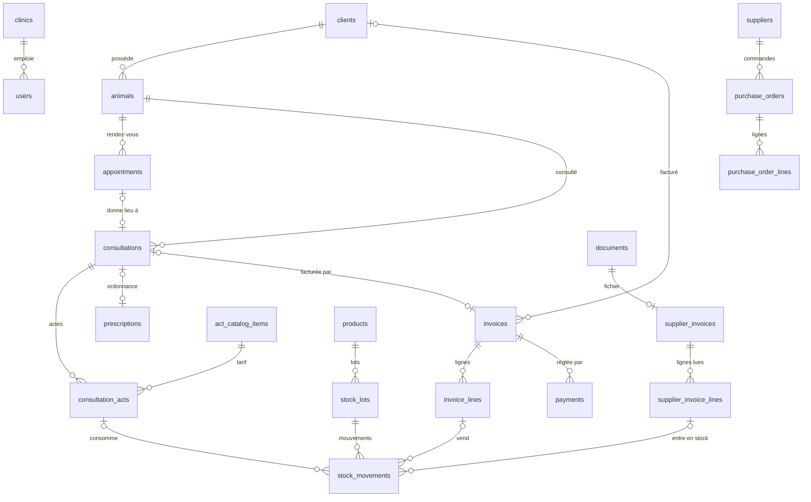
```mermaid
erDiagram
  clinics ||--o{ users : "emploie"
  clients ||--o{ animals : "possède"
  animals ||--o{ appointments : "rendez-vous"
  animals ||--o{ consultations : "consulté"
  appointments |o--o| consultations : "donne lieu à"
  consultations ||--o{ consultation_acts : "actes"
  consultations |o--o| prescriptions : "ordonnance"
  consultations |o--o| invoices : "facturée par"
  clients |o--o{ invoices : "facturé"
  invoices ||--o{ invoice_lines : "lignes"
  invoices ||--o{ payments : "réglée par"
  act_catalog_items ||--o{ consultation_acts : "tarif"
  products ||--o{ stock_lots : "lots"
  stock_lots ||--o{ stock_movements : "mouvements"
  consultation_acts |o--o{ stock_movements : "consomme"
  invoice_lines |o--o{ stock_movements : "vend"
  suppliers ||--o{ purchase_orders : "commandes"
  purchase_orders ||--o{ purchase_order_lines : "lignes"
  documents ||--o| supplier_invoices : "fichier"
  supplier_invoices ||--o{ supplier_invoice_lines : "lignes lues"
  supplier_invoice_lines |o--o{ stock_movements : "entre en stock"
```

**Choix structurant : il n'y a pas de table « ventes ».** Toute vente est une facture (`invoices`) : une facture d'origine `CONSULTATION` ou une vente au comptoir d'origine `COUNTER`. L'onglet « Ventes » de l'inventaire lit les lignes de facture de type `PRODUCT`. Une seule source de vérité : pas de double saisie, pas d'écart entre les ventes et la facturation.

---

## 3. Accès et sécurité

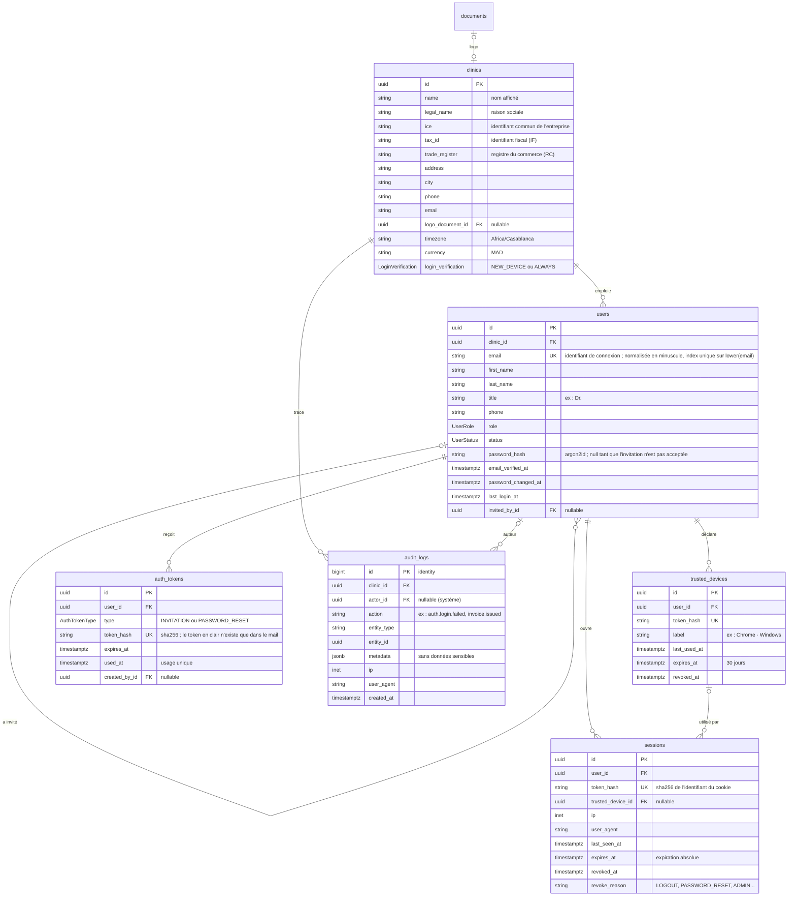
```mermaid
erDiagram
  clinics ||--o{ users : "emploie"
  users |o--o{ users : "a invité"
  users ||--o{ sessions : "ouvre"
  users ||--o{ trusted_devices : "déclare"
  trusted_devices |o--o{ sessions : "utilisé par"
  users ||--o{ auth_tokens : "reçoit"
  clinics ||--o{ audit_logs : "trace"
  users |o--o{ audit_logs : "auteur"
  documents |o--o| clinics : "logo"

  clinics {
    uuid id PK
    string name "nom affiché"
    string legal_name "raison sociale"
    string ice "identifiant commun de l'entreprise"
    string tax_id "identifiant fiscal (IF)"
    string trade_register "registre du commerce (RC)"
    string address
    string city
    string phone
    string email
    uuid logo_document_id FK "nullable"
    string timezone "Africa/Casablanca"
    string currency "MAD"
    LoginVerification login_verification "NEW_DEVICE ou ALWAYS"
  }

  users {
    uuid id PK
    uuid clinic_id FK
    string email UK "identifiant de connexion ; normalisée en minuscule, index unique sur lower(email)"
    string first_name
    string last_name
    string title "ex : Dr."
    string phone
    UserRole role
    UserStatus status
    string password_hash "argon2id ; null tant que l'invitation n'est pas acceptée"
    timestamptz email_verified_at
    timestamptz password_changed_at
    timestamptz last_login_at
    uuid invited_by_id FK "nullable"
  }

  sessions {
    uuid id PK
    uuid user_id FK
    string token_hash UK "sha256 de l'identifiant du cookie"
    uuid trusted_device_id FK "nullable"
    inet ip
    string user_agent
    timestamptz last_seen_at
    timestamptz expires_at "expiration absolue"
    timestamptz revoked_at
    string revoke_reason "LOGOUT, PASSWORD_RESET, ADMIN..."
  }

  trusted_devices {
    uuid id PK
    uuid user_id FK
    string token_hash UK
    string label "ex : Chrome · Windows"
    timestamptz last_used_at
    timestamptz expires_at "30 jours"
    timestamptz revoked_at
  }

  auth_tokens {
    uuid id PK
    uuid user_id FK
    AuthTokenType type "INVITATION ou PASSWORD_RESET"
    string token_hash UK "sha256 ; le token en clair n'existe que dans le mail"
    timestamptz expires_at
    timestamptz used_at "usage unique"
    uuid created_by_id FK "nullable"
  }

  audit_logs {
    bigint id PK "identity"
    uuid clinic_id FK
    uuid actor_id FK "nullable (système)"
    string action "ex : auth.login.failed, invoice.issued"
    string entity_type
    uuid entity_id
    jsonb metadata "sans données sensibles"
    inet ip
    string user_agent
    timestamptz created_at
  }
```

**Hors base de données (Redis) :** données de session actives (TTL glissant), codes de connexion à 6 chiffres (hachés, 10 min, 5 essais), compteurs d'échecs et de débit. `sessions` en base sert à l'historique et à la liste « appareils connectés » ; Redis fait foi pour la validité.

**Permissions :** elles ne sont pas en base. Le code contient la table rôle → permissions (voir `PLAN-BACKEND.md` §1.4) ; `users.role` suffit.

---

## 4. Référentiels : clients, animaux, catalogue des actes

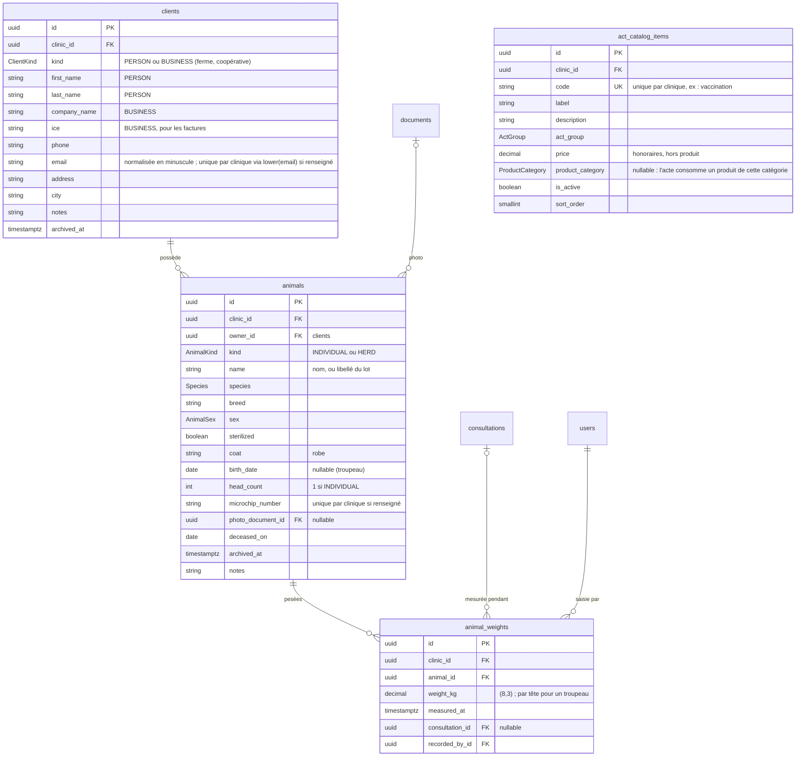
```mermaid
erDiagram
  clients ||--o{ animals : "possède"
  animals ||--o{ animal_weights : "pesées"
  consultations |o--o{ animal_weights : "mesurée pendant"
  users ||--o{ animal_weights : "saisie par"
  documents |o--o{ animals : "photo"

  clients {
    uuid id PK
    uuid clinic_id FK
    ClientKind kind "PERSON ou BUSINESS (ferme, coopérative)"
    string first_name "PERSON"
    string last_name "PERSON"
    string company_name "BUSINESS"
    string ice "BUSINESS, pour les factures"
    string phone
    string email "normalisée en minuscule ; unique par clinique via lower(email) si renseigné"
    string address
    string city
    string notes
    timestamptz archived_at
  }

  animals {
    uuid id PK
    uuid clinic_id FK
    uuid owner_id FK "clients"
    AnimalKind kind "INDIVIDUAL ou HERD"
    string name "nom, ou libellé du lot"
    Species species
    string breed
    AnimalSex sex
    boolean sterilized
    string coat "robe"
    date birth_date "nullable (troupeau)"
    int head_count "1 si INDIVIDUAL"
    string microchip_number "unique par clinique si renseigné"
    uuid photo_document_id FK "nullable"
    date deceased_on
    timestamptz archived_at
    string notes
  }

  animal_weights {
    uuid id PK
    uuid clinic_id FK
    uuid animal_id FK
    decimal weight_kg "(8,3) ; par tête pour un troupeau"
    timestamptz measured_at
    uuid consultation_id FK "nullable"
    uuid recorded_by_id FK
  }

  act_catalog_items {
    uuid id PK
    uuid clinic_id FK
    string code UK "unique par clinique, ex : vaccination"
    string label
    string description
    ActGroup act_group
    decimal price "honoraires, hors produit"
    ProductCategory product_category "nullable : l'acte consomme un produit de cette catégorie"
    boolean is_active
    smallint sort_order
  }
```

Le poids affiché est la dernière ligne de `animal_weights` (index `(animal_id, measured_at DESC)`).

---

## 5. Agenda

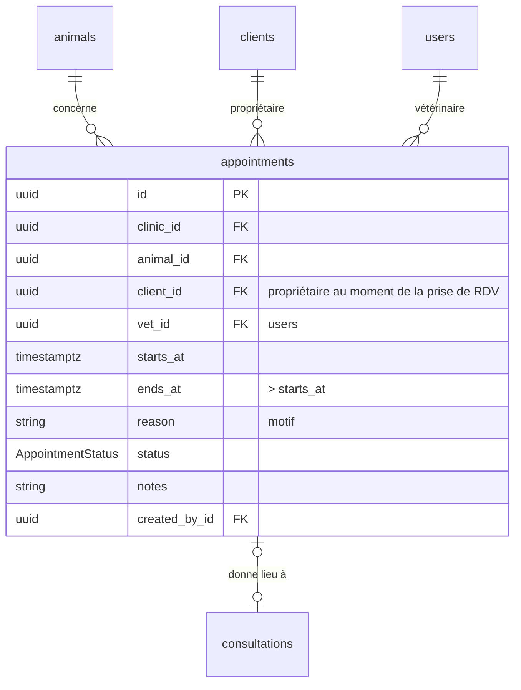
```mermaid
erDiagram
  animals ||--o{ appointments : "concerne"
  clients ||--o{ appointments : "propriétaire"
  users ||--o{ appointments : "vétérinaire"
  appointments |o--o| consultations : "donne lieu à"

  appointments {
    uuid id PK
    uuid clinic_id FK
    uuid animal_id FK
    uuid client_id FK "propriétaire au moment de la prise de RDV"
    uuid vet_id FK "users"
    timestamptz starts_at
    timestamptz ends_at "> starts_at"
    string reason "motif"
    AppointmentStatus status
    string notes
    uuid created_by_id FK
  }
```

Pas de chevauchement pour un même vétérinaire : contrainte d'exclusion (section 14).

---

## 6. Dossier médical : consultations et ordonnances

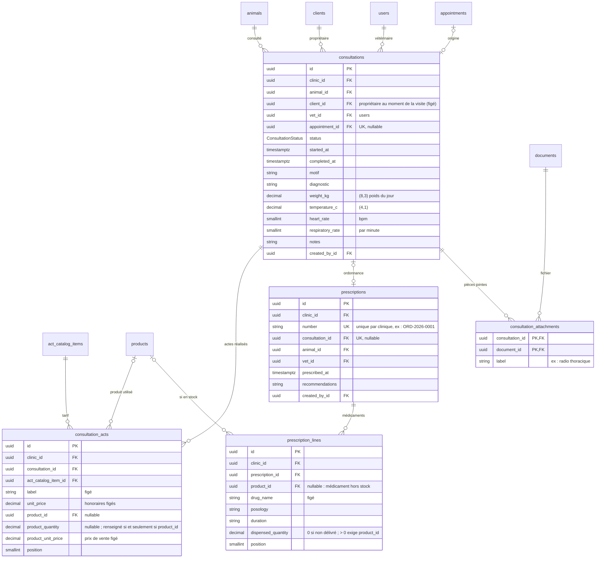
```mermaid
erDiagram
  animals ||--o{ consultations : "consulté"
  clients ||--o{ consultations : "propriétaire"
  users ||--o{ consultations : "vétérinaire"
  appointments |o--o| consultations : "origine"
  consultations ||--o{ consultation_acts : "actes réalisés"
  act_catalog_items ||--o{ consultation_acts : "tarif"
  products |o--o{ consultation_acts : "produit utilisé"
  consultations |o--o| prescriptions : "ordonnance"
  prescriptions ||--o{ prescription_lines : "médicaments"
  products |o--o{ prescription_lines : "si en stock"
  consultations ||--o{ consultation_attachments : "pièces jointes"
  documents ||--o{ consultation_attachments : "fichier"

  consultations {
    uuid id PK
    uuid clinic_id FK
    uuid animal_id FK
    uuid client_id FK "propriétaire au moment de la visite (figé)"
    uuid vet_id FK "users"
    uuid appointment_id FK "UK, nullable"
    ConsultationStatus status
    timestamptz started_at
    timestamptz completed_at
    string motif
    string diagnostic
    decimal weight_kg "(8,3) poids du jour"
    decimal temperature_c "(4,1)"
    smallint heart_rate "bpm"
    smallint respiratory_rate "par minute"
    string notes
    uuid created_by_id FK
  }

  consultation_acts {
    uuid id PK
    uuid clinic_id FK
    uuid consultation_id FK
    uuid act_catalog_item_id FK
    string label "figé"
    decimal unit_price "honoraires figés"
    uuid product_id FK "nullable"
    decimal product_quantity "nullable ; renseigné si et seulement si product_id"
    decimal product_unit_price "prix de vente figé"
    smallint position
  }

  prescriptions {
    uuid id PK
    uuid clinic_id FK
    string number UK "unique par clinique, ex : ORD-2026-0001"
    uuid consultation_id FK "UK, nullable"
    uuid animal_id FK
    uuid vet_id FK
    timestamptz prescribed_at
    string recommendations
    uuid created_by_id FK
  }

  prescription_lines {
    uuid id PK
    uuid clinic_id FK
    uuid prescription_id FK
    uuid product_id FK "nullable : médicament hors stock"
    string drug_name "figé"
    string posology
    string duration
    decimal dispensed_quantity "0 si non délivré ; > 0 exige product_id"
    smallint position
  }

  consultation_attachments {
    uuid consultation_id PK, FK
    uuid document_id PK, FK
    string label "ex : radio thoracique"
  }
```

**Traçabilité des lots :** la sortie de stock d'un acte est enregistrée dans `stock_movements` avec le lot consommé (section 8). On retrouve donc le lot de vaccin injecté à un animal donné, ce dont a besoin un certificat de vaccination.

---

## 7. Facturation

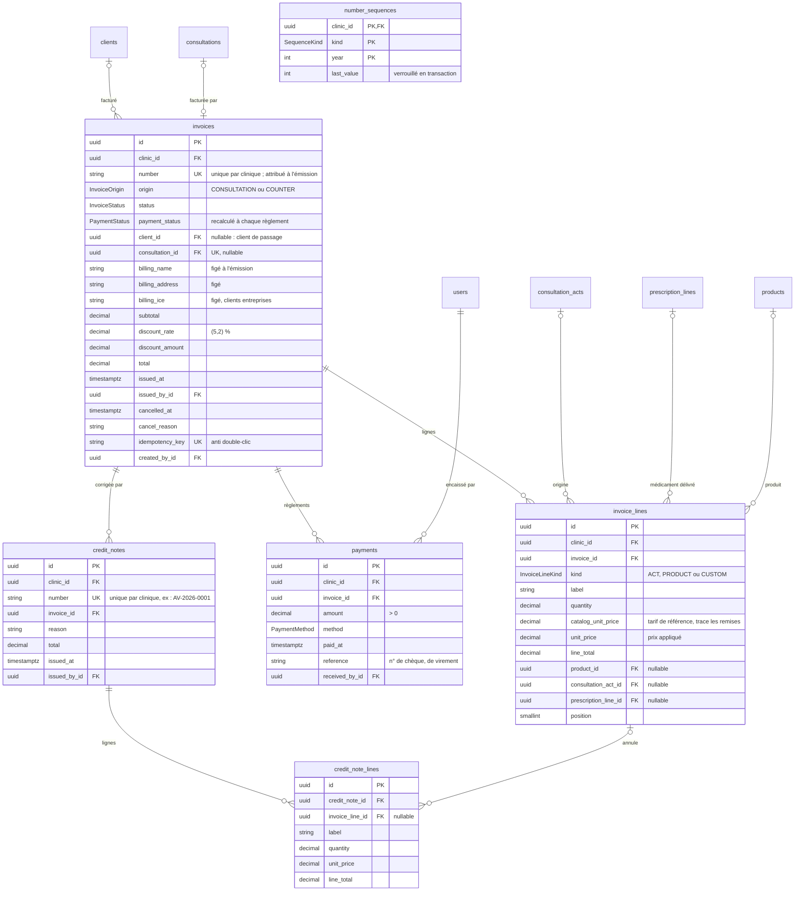
```mermaid
erDiagram
  clients |o--o{ invoices : "facturé"
  consultations |o--o| invoices : "facturée par"
  invoices ||--o{ invoice_lines : "lignes"
  consultation_acts |o--o{ invoice_lines : "origine"
  prescription_lines |o--o{ invoice_lines : "médicament délivré"
  products |o--o{ invoice_lines : "produit"
  invoices ||--o{ payments : "règlements"
  users ||--o{ payments : "encaissé par"
  invoices ||--o{ credit_notes : "corrigée par"
  credit_notes ||--o{ credit_note_lines : "lignes"
  invoice_lines |o--o{ credit_note_lines : "annule"

  invoices {
    uuid id PK
    uuid clinic_id FK
    string number UK "unique par clinique ; attribué à l'émission"
    InvoiceOrigin origin "CONSULTATION ou COUNTER"
    InvoiceStatus status
    PaymentStatus payment_status "recalculé à chaque règlement"
    uuid client_id FK "nullable : client de passage"
    uuid consultation_id FK "UK, nullable"
    string billing_name "figé à l'émission"
    string billing_address "figé"
    string billing_ice "figé, clients entreprises"
    decimal subtotal
    decimal discount_rate "(5,2) %"
    decimal discount_amount
    decimal total
    timestamptz issued_at
    uuid issued_by_id FK
    timestamptz cancelled_at
    string cancel_reason
    string idempotency_key UK "anti double-clic"
    uuid created_by_id FK
  }

  invoice_lines {
    uuid id PK
    uuid clinic_id FK
    uuid invoice_id FK
    InvoiceLineKind kind "ACT, PRODUCT ou CUSTOM"
    string label
    decimal quantity
    decimal catalog_unit_price "tarif de référence, trace les remises"
    decimal unit_price "prix appliqué"
    decimal line_total
    uuid product_id FK "nullable"
    uuid consultation_act_id FK "nullable"
    uuid prescription_line_id FK "nullable"
    smallint position
  }

  payments {
    uuid id PK
    uuid clinic_id FK
    uuid invoice_id FK
    decimal amount "> 0"
    PaymentMethod method
    timestamptz paid_at
    string reference "n° de chèque, de virement"
    uuid received_by_id FK
  }

  credit_notes {
    uuid id PK
    uuid clinic_id FK
    string number UK "unique par clinique, ex : AV-2026-0001"
    uuid invoice_id FK
    string reason
    decimal total
    timestamptz issued_at
    uuid issued_by_id FK
  }

  credit_note_lines {
    uuid id PK
    uuid credit_note_id FK
    uuid invoice_line_id FK "nullable"
    string label
    decimal quantity
    decimal unit_price
    decimal line_total
  }

  number_sequences {
    uuid clinic_id PK, FK
    SequenceKind kind PK
    int year PK
    int last_value "verrouillé en transaction"
  }
```

---

## 8. Stock et achats

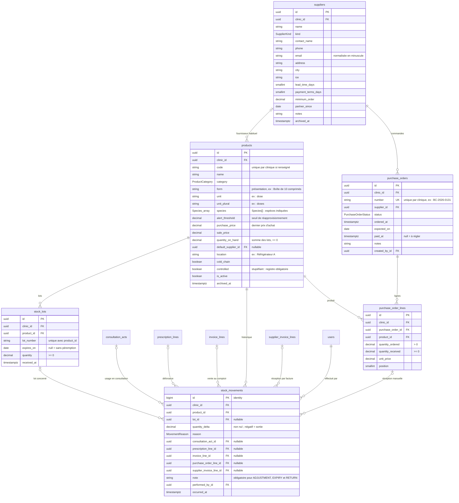
```mermaid
erDiagram
  suppliers |o--o{ products : "fournisseur habituel"
  products ||--o{ stock_lots : "lots"
  products ||--o{ stock_movements : "historique"
  stock_lots |o--o{ stock_movements : "lot concerné"
  consultation_acts |o--o{ stock_movements : "usage en consultation"
  prescription_lines |o--o{ stock_movements : "délivrance"
  invoice_lines |o--o{ stock_movements : "vente au comptoir"
  purchase_order_lines |o--o{ stock_movements : "réception manuelle"
  supplier_invoice_lines |o--o{ stock_movements : "réception par facture"
  users ||--o{ stock_movements : "effectué par"
  suppliers ||--o{ purchase_orders : "commandes"
  purchase_orders ||--o{ purchase_order_lines : "lignes"
  products ||--o{ purchase_order_lines : "produit"

  products {
    uuid id PK
    uuid clinic_id FK
    string code "unique par clinique si renseigné"
    string name
    ProductCategory category
    string form "présentation, ex : Boîte de 10 comprimés"
    string unit "ex : dose"
    string unit_plural "ex : doses"
    Species_array species "Species[] : espèces indiquées"
    decimal alert_threshold "seuil de réapprovisionnement"
    decimal purchase_price "dernier prix d'achat"
    decimal sale_price
    decimal quantity_on_hand "somme des lots, >= 0"
    uuid default_supplier_id FK "nullable"
    string location "ex : Réfrigérateur A"
    boolean cold_chain
    boolean controlled "stupéfiant : registre obligatoire"
    boolean is_active
    timestamptz archived_at
  }

  stock_lots {
    uuid id PK
    uuid clinic_id FK
    uuid product_id FK
    string lot_number "unique avec product_id"
    date expires_on "null = sans péremption"
    decimal quantity ">= 0"
    timestamptz received_at
  }

  stock_movements {
    bigint id PK "identity"
    uuid clinic_id FK
    uuid product_id FK
    uuid lot_id FK "nullable"
    decimal quantity_delta "non nul ; négatif = sortie"
    MovementReason reason
    uuid consultation_act_id FK "nullable"
    uuid prescription_line_id FK "nullable"
    uuid invoice_line_id FK "nullable"
    uuid purchase_order_line_id FK "nullable"
    uuid supplier_invoice_line_id FK "nullable"
    string note "obligatoire pour ADJUSTMENT, EXPIRY et RETURN"
    uuid performed_by_id FK
    timestamptz occurred_at
  }

  suppliers {
    uuid id PK
    uuid clinic_id FK
    string name
    SupplierKind kind
    string contact_name
    string phone
    string email "normalisée en minuscule"
    string address
    string city
    string ice
    smallint lead_time_days
    smallint payment_terms_days
    decimal minimum_order
    date partner_since
    string notes
    timestamptz archived_at
  }

  purchase_orders {
    uuid id PK
    uuid clinic_id FK
    string number UK "unique par clinique, ex : BC-2026-0131"
    uuid supplier_id FK
    PurchaseOrderStatus status
    timestamptz ordered_at
    date expected_on
    timestamptz paid_at "null = à régler"
    string notes
    uuid created_by_id FK
  }

  purchase_order_lines {
    uuid id PK
    uuid clinic_id FK
    uuid purchase_order_id FK
    uuid product_id FK
    decimal quantity_ordered "> 0"
    decimal quantity_received ">= 0"
    decimal unit_price
    smallint position
  }
```

Chaque mouvement concerne **un seul lot** : une sortie FEFO qui prend sur deux lots produit deux lignes. Le mouvement référence **une seule origine**, cohérente avec `reason` (section 14).

---

## 9. Documents et factures fournisseurs (OCR)

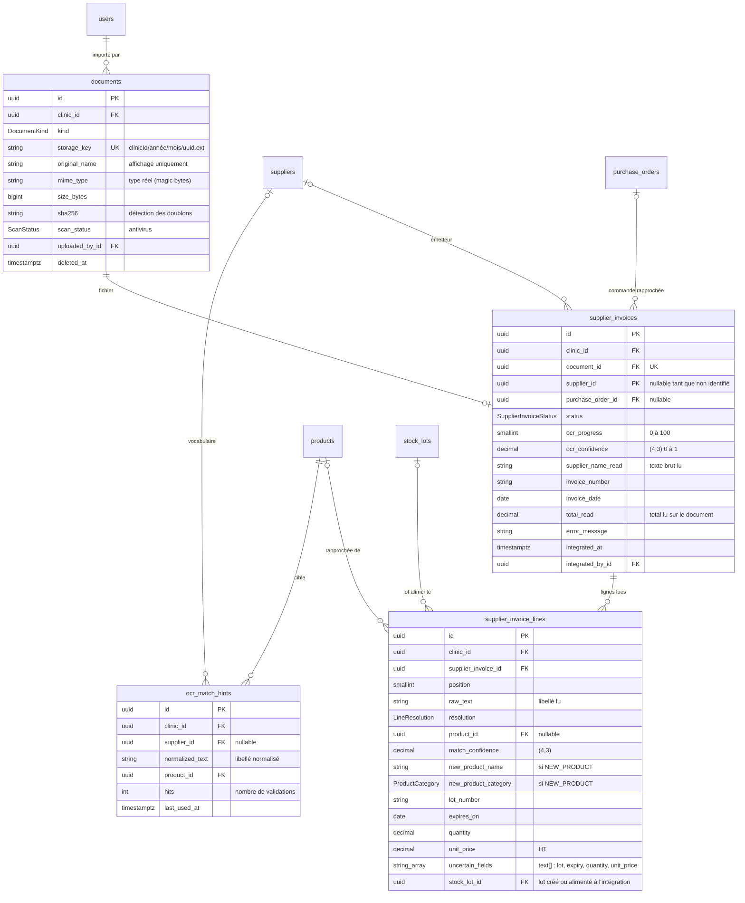
```mermaid
erDiagram
  users ||--o{ documents : "importé par"
  documents ||--o| supplier_invoices : "fichier"
  suppliers |o--o{ supplier_invoices : "émetteur"
  purchase_orders |o--o{ supplier_invoices : "commande rapprochée"
  supplier_invoices ||--o{ supplier_invoice_lines : "lignes lues"
  products |o--o{ supplier_invoice_lines : "rapprochée de"
  stock_lots |o--o{ supplier_invoice_lines : "lot alimenté"
  suppliers |o--o{ ocr_match_hints : "vocabulaire"
  products ||--o{ ocr_match_hints : "cible"

  documents {
    uuid id PK
    uuid clinic_id FK
    DocumentKind kind
    string storage_key UK "clinicId/année/mois/uuid.ext"
    string original_name "affichage uniquement"
    string mime_type "type réel (magic bytes)"
    bigint size_bytes
    string sha256 "détection des doublons"
    ScanStatus scan_status "antivirus"
    uuid uploaded_by_id FK
    timestamptz deleted_at
  }

  supplier_invoices {
    uuid id PK
    uuid clinic_id FK
    uuid document_id FK "UK"
    uuid supplier_id FK "nullable tant que non identifié"
    uuid purchase_order_id FK "nullable"
    SupplierInvoiceStatus status
    smallint ocr_progress "0 à 100"
    decimal ocr_confidence "(4,3) 0 à 1"
    string supplier_name_read "texte brut lu"
    string invoice_number
    date invoice_date
    decimal total_read "total lu sur le document"
    string error_message
    timestamptz integrated_at
    uuid integrated_by_id FK
  }

  supplier_invoice_lines {
    uuid id PK
    uuid clinic_id FK
    uuid supplier_invoice_id FK
    smallint position
    string raw_text "libellé lu"
    LineResolution resolution
    uuid product_id FK "nullable"
    decimal match_confidence "(4,3)"
    string new_product_name "si NEW_PRODUCT"
    ProductCategory new_product_category "si NEW_PRODUCT"
    string lot_number
    date expires_on
    decimal quantity
    decimal unit_price "HT"
    string_array uncertain_fields "text[] : lot, expiry, quantity, unit_price"
    uuid stock_lot_id FK "lot créé ou alimenté à l'intégration"
  }

  ocr_match_hints {
    uuid id PK
    uuid clinic_id FK
    uuid supplier_id FK "nullable"
    string normalized_text "libellé normalisé"
    uuid product_id FK
    int hits "nombre de validations"
    timestamptz last_used_at
  }
```

`ocr_match_hints` retient chaque rapprochement validé par un humain : la fois suivante, le même libellé du même fournisseur est rapproché automatiquement.

Les autres fichiers sont reliés à `documents` par des clés étrangères dédiées (`clinics.logo_document_id`, `animals.photo_document_id`, `consultation_attachments`) : **pas de relation polymorphe**, pour que chaque lien soit vérifié par la base.

---

## 10. Alertes

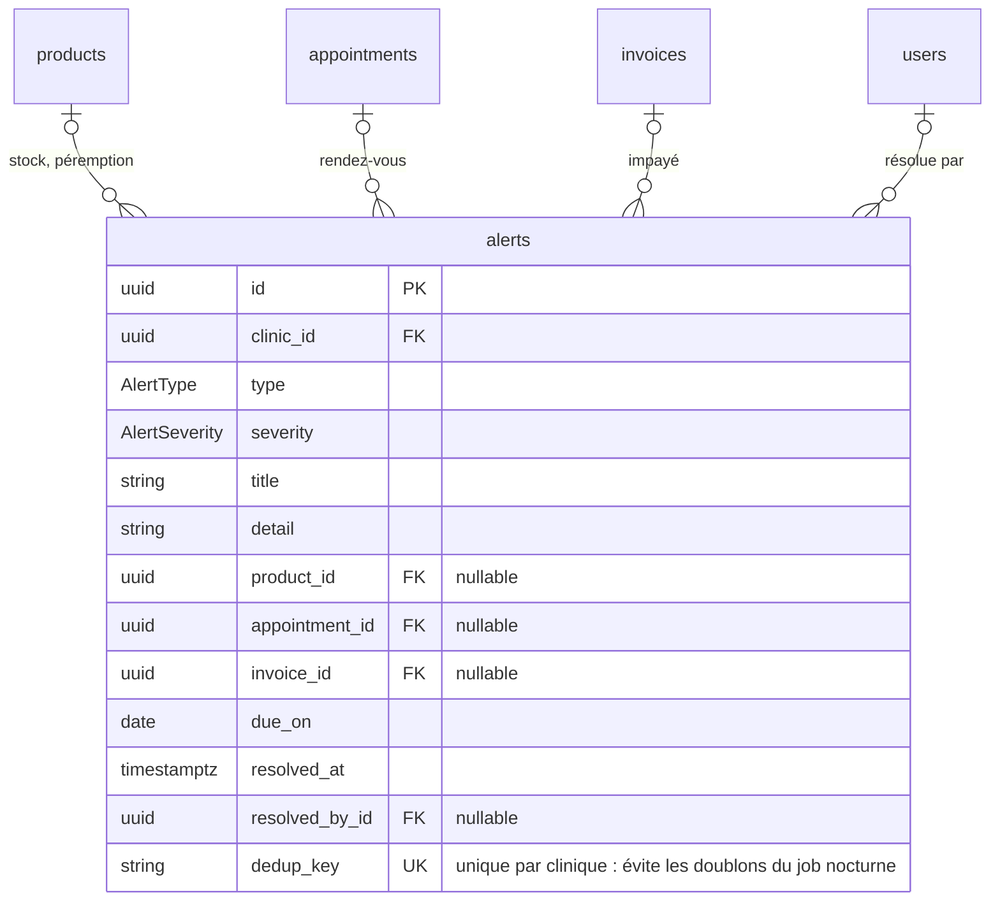
```mermaid
erDiagram
  products |o--o{ alerts : "stock, péremption"
  appointments |o--o{ alerts : "rendez-vous"
  invoices |o--o{ alerts : "impayé"
  users |o--o{ alerts : "résolue par"

  alerts {
    uuid id PK
    uuid clinic_id FK
    AlertType type
    AlertSeverity severity
    string title
    string detail
    uuid product_id FK "nullable"
    uuid appointment_id FK "nullable"
    uuid invoice_id FK "nullable"
    date due_on
    timestamptz resolved_at
    uuid resolved_by_id FK "nullable"
    string dedup_key UK "unique par clinique : évite les doublons du job nocturne"
  }
```

---

## 11. Énumérations

Valeurs en anglais dans la base et le code ; libellés français dans l'interface.

| Énumération | Valeurs → libellé |
|---|---|
| `UserRole` | `ADMIN` Administrateur · `VET` Vétérinaire · `ASSISTANT` Assistant·e · `RECEPTION` Accueil |
| `UserStatus` | `INVITED` Invité · `ACTIVE` Actif · `DISABLED` Désactivé |
| `LoginVerification` | `NEW_DEVICE` Nouvel appareil · `ALWAYS` À chaque connexion |
| `AuthTokenType` | `INVITATION` · `PASSWORD_RESET` |
| `ClientKind` | `PERSON` Particulier · `BUSINESS` Entreprise (ferme, coopérative) |
| `AnimalKind` | `INDIVIDUAL` Individuel · `HERD` Troupeau |
| `Species` | `DOG` Chien · `CAT` Chat · `RABBIT` Lapin · `BIRD` Oiseau · `SHEEP` Mouton · `COW` Vache · `GOAT` Chèvre · `POULTRY` Volaille · `OTHER` Autre |
| `AnimalSex` | `MALE` Mâle · `FEMALE` Femelle · `MIXED` Mixte (troupeau) · `UNKNOWN` Inconnu |
| `ActGroup` | `EXAM` Examens · `WITH_PRODUCT` Actes avec produit · `CARE` Soins et interventions |
| `AppointmentStatus` | `PENDING` En attente · `CONFIRMED` Confirmé · `DONE` Terminé · `CANCELLED` Annulé · `NO_SHOW` Absent |
| `ConsultationStatus` | `IN_PROGRESS` En cours · `COMPLETED` Terminée · `CANCELLED` Annulée |
| `InvoiceOrigin` | `CONSULTATION` · `COUNTER` Comptoir |
| `InvoiceStatus` | `DRAFT` Brouillon · `ISSUED` Émise · `CANCELLED` Annulée |
| `PaymentStatus` | `UNPAID` À régler · `PARTIAL` Partiellement réglée · `PAID` Payée |
| `InvoiceLineKind` | `ACT` Acte · `PRODUCT` Produit · `CUSTOM` Ligne libre |
| `PaymentMethod` | `CASH` Espèces · `CARD` Carte bancaire · `CHEQUE` Chèque · `TRANSFER` Virement |
| `SequenceKind` | `INVOICE` · `CREDIT_NOTE` · `PRESCRIPTION` · `PURCHASE_ORDER` |
| `ProductCategory` | `VACCINE` Vaccin · `ANTIPARASITIC` Antiparasitaire · `INJECTABLE` Injectable · `MEDICATION` Médicament · `CONSUMABLE` Consommable |
| `MovementReason` | `CONSULTATION` · `DISPENSE` Délivrance sur ordonnance · `COUNTER_SALE` Vente · `PURCHASE_RECEIPT` Réception de commande · `SUPPLIER_INVOICE` Facture fournisseur · `ADJUSTMENT` Ajustement · `EXPIRY` Péremption · `RETURN` Retour |
| `SupplierKind` | `WHOLESALER` Grossiste · `LABORATORY` Laboratoire · `IMPORTER` Importateur · `CONSUMABLES` Consommables |
| `PurchaseOrderStatus` | `DRAFT` Brouillon · `ORDERED` Commandée · `PARTIALLY_RECEIVED` Partielle · `RECEIVED` Reçue · `CANCELLED` Annulée |
| `DocumentKind` | `SUPPLIER_INVOICE` · `ANIMAL_PHOTO` · `CONSULTATION_ATTACHMENT` · `CLINIC_LOGO` · `GENERATED_PDF` |
| `ScanStatus` | `PENDING` · `CLEAN` · `INFECTED` |
| `SupplierInvoiceStatus` | `QUEUED` En file · `PROCESSING` Lecture en cours · `NEEDS_REVIEW` À vérifier · `INTEGRATED` Intégrée · `FAILED` Échec · `REJECTED` Rejetée |
| `LineResolution` | `UNRESOLVED` À rapprocher · `MATCHED` Rapprochée · `NEW_PRODUCT` Nouveau produit · `IGNORED` Ignorée |
| `AlertType` | `LOW_STOCK` · `EXPIRY` · `APPOINTMENT_UNCONFIRMED` · `INVOICE_OVERDUE` · `VACCINE_REMINDER` |
| `AlertSeverity` | `HIGH` · `MEDIUM` · `LOW` |

---

## 12. Cycles de vie (statuts)

Toute transition non dessinée est **refusée par le service** (erreur 409).

### Consultation

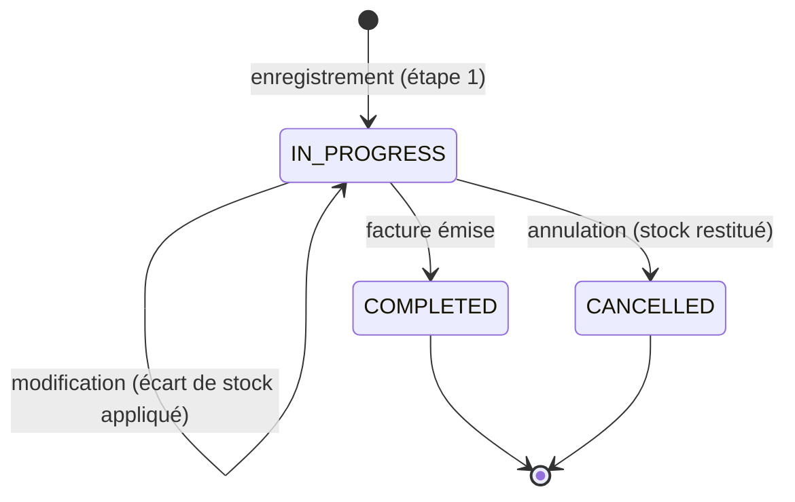
```mermaid
stateDiagram-v2
  [*] --> IN_PROGRESS : enregistrement (étape 1)
  IN_PROGRESS --> IN_PROGRESS : modification (écart de stock appliqué)
  IN_PROGRESS --> COMPLETED : facture émise
  IN_PROGRESS --> CANCELLED : annulation (stock restitué)
  COMPLETED --> [*]
  CANCELLED --> [*]
```

Une consultation `COMPLETED` n'est plus modifiable : une correction passe par un avoir sur sa facture.

### Facture client

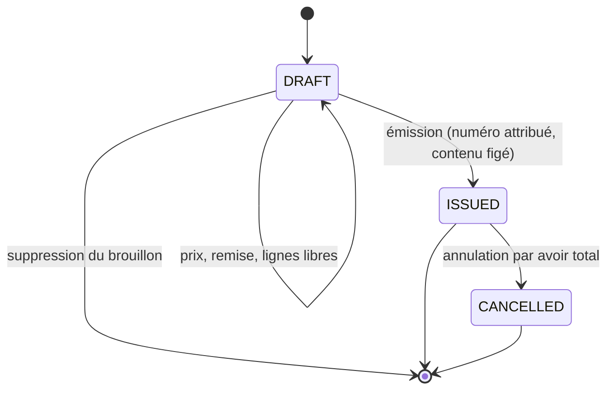
```mermaid
stateDiagram-v2
  [*] --> DRAFT
  DRAFT --> DRAFT : prix, remise, lignes libres
  DRAFT --> ISSUED : émission (numéro attribué, contenu figé)
  DRAFT --> [*] : suppression du brouillon
  ISSUED --> CANCELLED : annulation par avoir total
  ISSUED --> [*]
  CANCELLED --> [*]
```

`payment_status` évolue indépendamment (`UNPAID` → `PARTIAL` → `PAID`) au fil des `payments`, uniquement sur une facture `ISSUED`.

### Commande fournisseur

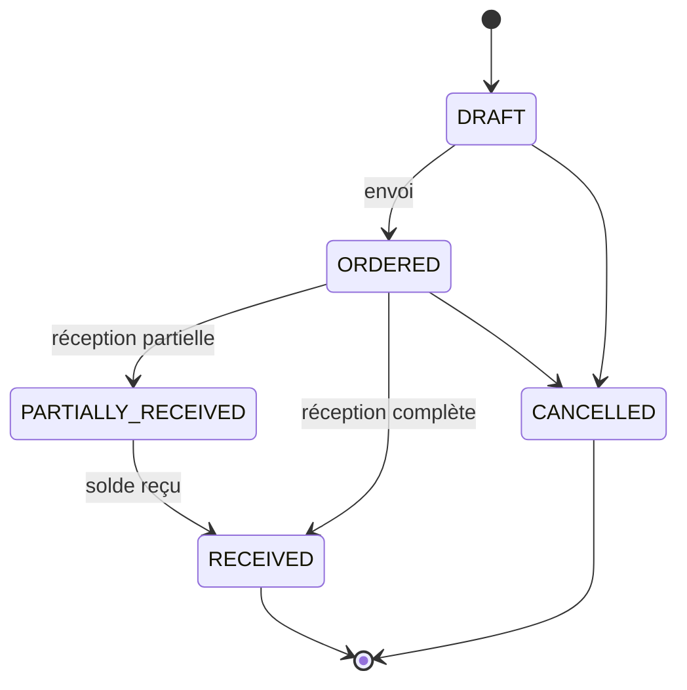
```mermaid
stateDiagram-v2
  [*] --> DRAFT
  DRAFT --> ORDERED : envoi
  DRAFT --> CANCELLED
  ORDERED --> PARTIALLY_RECEIVED : réception partielle
  ORDERED --> RECEIVED : réception complète
  PARTIALLY_RECEIVED --> RECEIVED : solde reçu
  ORDERED --> CANCELLED
  RECEIVED --> [*]
  CANCELLED --> [*]
```

### Facture fournisseur (OCR)

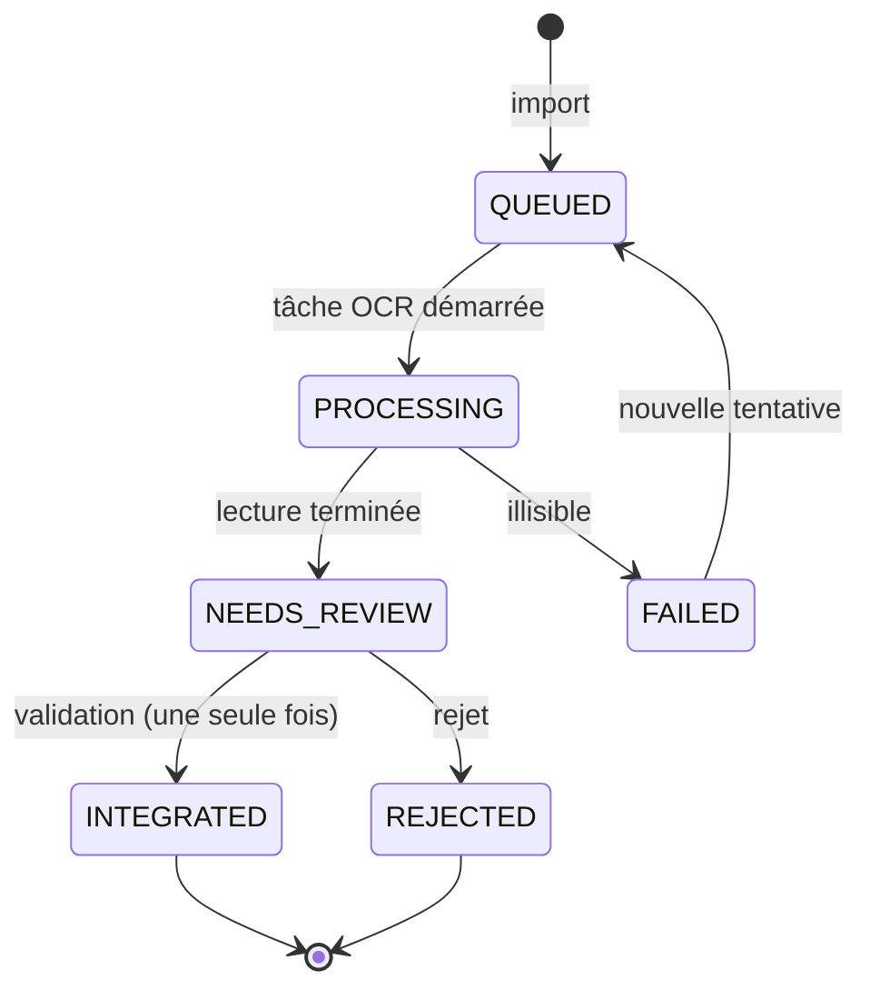
```mermaid
stateDiagram-v2
  [*] --> QUEUED : import
  QUEUED --> PROCESSING : tâche OCR démarrée
  PROCESSING --> NEEDS_REVIEW : lecture terminée
  PROCESSING --> FAILED : illisible
  NEEDS_REVIEW --> INTEGRATED : validation (une seule fois)
  NEEDS_REVIEW --> REJECTED : rejet
  FAILED --> QUEUED : nouvelle tentative
  INTEGRATED --> [*]
  REJECTED --> [*]
```

### Rendez-vous

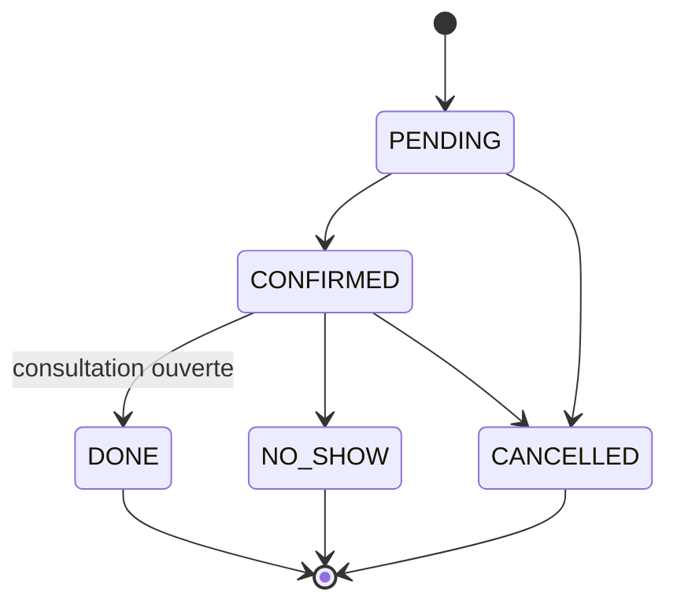
```mermaid
stateDiagram-v2
  [*] --> PENDING
  PENDING --> CONFIRMED
  PENDING --> CANCELLED
  CONFIRMED --> DONE : consultation ouverte
  CONFIRMED --> NO_SHOW
  CONFIRMED --> CANCELLED
  DONE --> [*]
  NO_SHOW --> [*]
  CANCELLED --> [*]
```

---

## 13. Règles d'intégrité et leur application dans la logique

Chaque règle est appliquée **deux fois** quand c'est possible : par la base (dernier rempart) et par le service (message d'erreur clair). La colonne « Test » est obligatoire avant de fermer la phase concernée.

| # | Règle | Base de données | Service (API) | Test |
|---|---|---|---|---|
| R1 | Une clinique ne voit et ne lie que ses propres données | FK composites `(clinic_id, …)` | Extension Prisma qui injecte `clinic_id` de la session dans chaque requête | Accès croisé entre deux cliniques → 404 |
| R2 | Le stock n'est jamais négatif | `CHECK (quantity >= 0)` sur `stock_lots` et `products.quantity_on_hand` | `InventoryService.consume()` : lots verrouillés `FOR UPDATE`, puis erreur 409 si la quantité est insuffisante | 50 sorties parallèles sur le même produit |
| R3 | Sortie FEFO : le lot qui périme le plus tôt sort en premier (lots périmés exclus) | Index `(product_id, expires_on)` | `consume()` trie par `expires_on NULLS LAST` et ignore les lots périmés | Deux lots, dont un périmé |
| R4 | `quantity_on_hand` = somme des lots | — | Seul `InventoryService` écrit les lots et le total, dans la même transaction ; job nocturne de contrôle de cohérence | Contrôle après chaque test e2e de stock |
| R5 | Tout changement de quantité laisse un mouvement | Déclencheur : `stock_movements` en ajout seul | Aucune écriture de `stock_lots` hors de `InventoryService` | Ajustement → 1 mouvement ; sortie sur 2 lots → 2 mouvements |
| R6 | Un mouvement a une origine cohérente avec son motif | `CHECK` (section 14) | Construit uniquement par `InventoryService` | Mouvement `CONSULTATION` sans acte → refusé |
| R7 | Modifier une consultation n'impute que l'écart de stock | — | `ConsultationsService.update()` compare l'avant et l'après par produit dans une transaction | Modifier deux fois la même consultation |
| R8 | Les prix d'un document émis ne changent plus | Colonnes de prix copiées (`unit_price`, `billing_*`) | Copie à la création de l'acte et à l'émission ; les services ne relisent jamais le catalogue pour un document émis | Changer un tarif puis relire une ancienne facture |
| R9 | Numérotation des factures continue, par clinique et par année | `number_sequences` + `UNIQUE (clinic_id, number)` | `SequenceService.next()` : `UPDATE … RETURNING` dans la transaction d'émission | 20 émissions parallèles : ni doublon ni trou |
| R10 | Une facture émise est immuable | Déclencheur : refuse la modification des montants et des lignes d'une facture `ISSUED` | Correction uniquement par `credit_notes` | `PATCH` sur une facture émise → 409 |
| R11 | Une consultation a au plus une facture et une ordonnance | `UNIQUE (consultation_id)` sur `invoices` et `prescriptions` | Réutilise l'existante au lieu d'en créer une seconde | Double validation |
| R12 | Pas de double facture sur un double clic | `UNIQUE (idempotency_key)` | En-tête `Idempotency-Key` exigé à la création | Même clé deux fois → même facture |
| R13 | Le total réglé ne dépasse pas le total de la facture | — | `PaymentsService` recalcule la somme et `payment_status` en transaction | Paiement excédentaire → 422 |
| R14 | Un vétérinaire n'a pas deux rendez-vous en même temps | `EXCLUDE USING gist` (section 14) | Erreur de contrainte traduite en 409 lisible | Deux RDV qui se chevauchent |
| R15 | Une facture fournisseur n'est intégrée qu'une fois | `UNIQUE (clinic_id, supplier_id, invoice_number) WHERE status = 'INTEGRATED'` | Transition `NEEDS_REVIEW → INTEGRATED` vérifiée ; tout se fait dans une seule transaction | Double intégration |
| R16 | L'intégration n'a lieu que si toutes les lignes sont résolues | — | Refus si une ligne est `UNRESOLVED` | Ligne non rapprochée → 422 |
| R17 | Délivrer un médicament exige un produit du stock | `CHECK (dispensed_quantity = 0 OR product_id IS NOT NULL)` | Validation Zod + service | — |
| R18 | Un acte avec produit a une quantité, et inversement | `CHECK ((product_id IS NULL) = (product_quantity IS NULL))` | Idem | — |
| R19 | Un animal individuel compte une tête | `CHECK (kind = 'HERD' OR head_count = 1)` et `head_count >= 1` | Idem | — |
| R20 | L'historique médical et comptable n'est jamais supprimé | `ON DELETE RESTRICT` | Archivage (`archived_at`), désactivation des utilisateurs, annulation plutôt que suppression | Supprimer un client avec consultations → 409 |
| R21 | Aucun secret en clair en base | Colonnes `*_hash` uniquement | Tokens hachés en SHA-256, mots de passe en Argon2id | Inspection des colonnes en test |
| R22 | Journaux inaltérables | Déclencheur : `audit_logs` et `stock_movements` refusent `UPDATE` et `DELETE` | — | Tentative d'UPDATE → erreur |

**Qui écrit quoi.** Un seul service est propriétaire de chaque table en écriture ; les autres passent par lui.

| Service propriétaire | Tables écrites |
|---|---|
| `AuthService`, `UsersService` | `users`, `sessions`, `trusted_devices`, `auth_tokens` |
| `AuditService` | `audit_logs` |
| `ClientsService`, `AnimalsService` | `clients`, `animals`, `animal_weights` |
| `CatalogService` | `act_catalog_items` |
| `AppointmentsService` | `appointments` |
| `ConsultationsService` | `consultations`, `consultation_acts`, `consultation_attachments` |
| `PrescriptionsService` | `prescriptions`, `prescription_lines` |
| `BillingService` | `invoices`, `invoice_lines`, `payments`, `credit_notes`, `credit_note_lines` |
| `SequenceService` | `number_sequences` |
| `InventoryService` | `products`, `stock_lots`, `stock_movements` |
| `PurchasingService` | `suppliers`, `purchase_orders`, `purchase_order_lines` |
| `DocumentsService` | `documents` |
| `SupplierInvoicesService` | `supplier_invoices`, `supplier_invoice_lines`, `ocr_match_hints` |
| `AlertsService` | `alerts` |

---

## 14. Contraintes et index hors Prisma (SQL de migration)

Prisma ne sait pas exprimer ces éléments : ils sont ajoutés à la main dans le fichier SQL de la migration concernée (`prisma migrate dev --create-only`, puis édition).

```sql
-- Extensions (migration initiale)
CREATE EXTENSION IF NOT EXISTS pg_trgm;
CREATE EXTENSION IF NOT EXISTS btree_gist;

-- Stock (R2, R6)
ALTER TABLE stock_lots ADD CONSTRAINT stock_lots_quantity_non_negative CHECK (quantity >= 0);
ALTER TABLE products   ADD CONSTRAINT products_quantity_non_negative CHECK (quantity_on_hand >= 0);
ALTER TABLE stock_movements ADD CONSTRAINT stock_movements_delta_non_zero CHECK (quantity_delta <> 0);
ALTER TABLE stock_movements ADD CONSTRAINT stock_movements_source_matches_reason CHECK (
  (reason = 'CONSULTATION'      AND consultation_act_id      IS NOT NULL) OR
  (reason = 'DISPENSE'          AND prescription_line_id     IS NOT NULL) OR
  (reason = 'COUNTER_SALE'      AND invoice_line_id          IS NOT NULL) OR
  (reason = 'PURCHASE_RECEIPT'  AND purchase_order_line_id   IS NOT NULL) OR
  (reason = 'SUPPLIER_INVOICE'  AND supplier_invoice_line_id IS NOT NULL) OR
  (reason IN ('ADJUSTMENT', 'EXPIRY', 'RETURN') AND note IS NOT NULL)
);

-- Agenda (R14)
ALTER TABLE appointments ADD CONSTRAINT appointments_valid_range CHECK (ends_at > starts_at);
ALTER TABLE appointments ADD CONSTRAINT appointments_no_overlap
  EXCLUDE USING gist (clinic_id WITH =, vet_id WITH =, tstzrange(starts_at, ends_at) WITH &&)
  WHERE (status NOT IN ('CANCELLED', 'NO_SHOW'));

-- Médical (R17, R18, R19)
ALTER TABLE prescription_lines ADD CONSTRAINT dispense_requires_product
  CHECK (dispensed_quantity = 0 OR product_id IS NOT NULL);
ALTER TABLE consultation_acts ADD CONSTRAINT act_product_quantity_pair
  CHECK ((product_id IS NULL) = (product_quantity IS NULL));
ALTER TABLE animals ADD CONSTRAINT animals_head_count
  CHECK (head_count >= 1 AND (kind = 'HERD' OR head_count = 1));

-- Facturation (R9, R13)
ALTER TABLE invoices ADD CONSTRAINT issued_invoice_has_number
  CHECK (status = 'DRAFT' OR number IS NOT NULL);
ALTER TABLE payments ADD CONSTRAINT payments_positive CHECK (amount > 0);

-- Unicités
CREATE UNIQUE INDEX users_email_unique_ci ON users (lower(email));  -- R21-adjacent : unicité globale, insensible à la casse
CREATE UNIQUE INDEX clients_email_per_clinic ON clients (clinic_id, lower(email))
  WHERE email IS NOT NULL AND archived_at IS NULL;
CREATE UNIQUE INDEX animals_microchip_per_clinic ON animals (clinic_id, microchip_number)
  WHERE microchip_number IS NOT NULL;
CREATE UNIQUE INDEX products_code_per_clinic ON products (clinic_id, code) WHERE code IS NOT NULL;
CREATE UNIQUE INDEX suppliers_email_per_clinic ON suppliers (clinic_id, lower(email))
  WHERE email IS NOT NULL AND archived_at IS NULL;
CREATE UNIQUE INDEX supplier_invoice_integrated_once
  ON supplier_invoices (clinic_id, supplier_id, invoice_number) WHERE status = 'INTEGRATED';  -- R15

-- Journaux en ajout seul (R5, R22)
CREATE FUNCTION forbid_update_delete() RETURNS trigger AS $$
BEGIN
  RAISE EXCEPTION '% est en ajout seul', TG_TABLE_NAME;
END $$ LANGUAGE plpgsql;
CREATE TRIGGER audit_logs_append_only BEFORE UPDATE OR DELETE ON audit_logs
  FOR EACH ROW EXECUTE FUNCTION forbid_update_delete();
CREATE TRIGGER stock_movements_append_only BEFORE UPDATE OR DELETE ON stock_movements
  FOR EACH ROW EXECUTE FUNCTION forbid_update_delete();

-- Facture émise immuable (R10) : déclencheur sur invoice_lines et sur les colonnes
-- de montant de invoices lorsque status = 'ISSUED' (écrit dans la migration de la Phase 4).

-- Recherche plein texte tolérante (listes, pickers)
CREATE INDEX clients_search  ON clients  USING gin ((coalesce(first_name,'') || ' ' || coalesce(last_name,'') || ' ' || coalesce(company_name,'')) gin_trgm_ops);
CREATE INDEX animals_search  ON animals  USING gin (name gin_trgm_ops);
CREATE INDEX products_search ON products USING gin (name gin_trgm_ops);
```

Index déclarés dans Prisma (`@@index`) :

| Table | Index | Usage |
|---|---|---|
| `animals` | `(clinic_id, owner_id)` | Animaux d'un client |
| `animal_weights` | `(animal_id, measured_at DESC)` | Dernier poids |
| `appointments` | `(clinic_id, starts_at)`, `(clinic_id, vet_id, starts_at)` | Agenda, calendrier |
| `consultations` | `(clinic_id, animal_id, started_at DESC)`, `(clinic_id, started_at DESC)` | Historique d'un animal, liste |
| `invoices` | `(clinic_id, issued_at DESC)`, `(clinic_id, payment_status)` | Liste, impayés |
| `invoice_lines` | `(clinic_id, product_id)` | Onglet Ventes |
| `stock_lots` | `(product_id, expires_on)` | FEFO, péremptions |
| `stock_movements` | `(clinic_id, product_id, occurred_at DESC)` | Historique d'un produit |
| `purchase_orders` | `(clinic_id, status)`, `(clinic_id, supplier_id)` | Commandes en attente, fiche fournisseur |
| `supplier_invoices` | `(clinic_id, status)` | Filtres de l'onglet Factures |
| `audit_logs` | `(clinic_id, created_at DESC)`, `(entity_type, entity_id)` | Consultation du journal |
| `sessions` | `(user_id, revoked_at)` | Appareils connectés |

---

## 15. Correspondance avec les données de démo du frontend

Pour la migration du frontend et l'écriture du seed.

| Fichier frontend actuel | Tables cibles | Remarques |
|---|---|---|
| `clients/_components/data.ts` | `clients` | `name` → `first_name` + `last_name` ; les fermes et coopératives deviennent `kind = BUSINESS` |
| `animaux/_components/data.ts` | `animals`, `animal_weights` | `weightKg` → une première pesée ; `individuel`/`troupeau` → `INDIVIDUAL`/`HERD` |
| `appointments/_components/data.ts` | `appointments` | `date` + `time` → `starts_at` ; durée par défaut 30 min pour `ends_at` ; `VETS` → `users` de rôle `VET` |
| `consultations/(tabs)/liste/_components/data.ts` | `consultations`, `consultation_acts` | `vitals` → colonnes ; `acts[].detail` redevient `product_id` + `product_quantity` |
| `consultations/(tabs)/prescriptions/_components/data.ts` | `prescriptions`, `prescription_lines` | Les anciennes ordonnances en texte libre → une ligne sans `product_id` |
| `consultations/nouvelle/_components/catalog.ts` (`ACTS`) | `act_catalog_items` | Les normes de constantes (`VITAL_RANGES`) restent des constantes du code |
| `inventory/_components/invoices-data.ts` | `invoices`, `invoice_lines`, `payments` | `status: Payée` → un `payment` du montant total |
| `inventory/_components/stock-data.ts` | `products`, `stock_lots`, `stock_movements` | `lots[]` → `stock_lots` ; `STOCK_MOVEMENTS` → `stock_movements` |
| `inventory/_components/trade-data.ts` — `SALES` | `invoices` (`origin = COUNTER`), `invoice_lines` | Plus de table ventes (section 2) |
| `inventory/_components/trade-data.ts` — `PURCHASES` | `purchase_orders`, `purchase_order_lines` | `receivedQuantity` → `quantity_received` |
| `inventory/_components/suppliers-data.ts` | `suppliers` | |
| `inventory/_components/supplier-invoices-data.ts` | `documents`, `supplier_invoices`, `supplier_invoice_lines` | Les factures de démo n'ont pas de fichier : un PDF factice par facture dans le seed |
| `_components/alerts-data.ts` (tableau de bord) | `alerts` | Générées ensuite par le job nocturne |
